    <h3>Hi there 👋</h3>
    

        Welcome to my github! I am a bioinformatics scientist at <a href="https://www.niaid.nih.gov/research/research-technologies-branch-integrated-data-sciences">NIAID</a> and the development team lead at <a href="https://github.com/OpenOmics">OpenOmics</a>. 
    

    

        OpenOmics is an open-source, collaborative community on a mission to push science and bioinformatics forward. To learn more about OpenOmics, please visit our <a href="https://github.com/OpenOmics">github organization</a>.
    

    <h4>Github metrics</h4>
    

